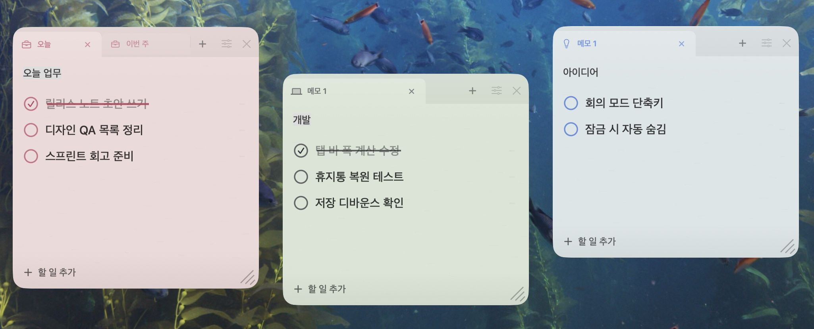
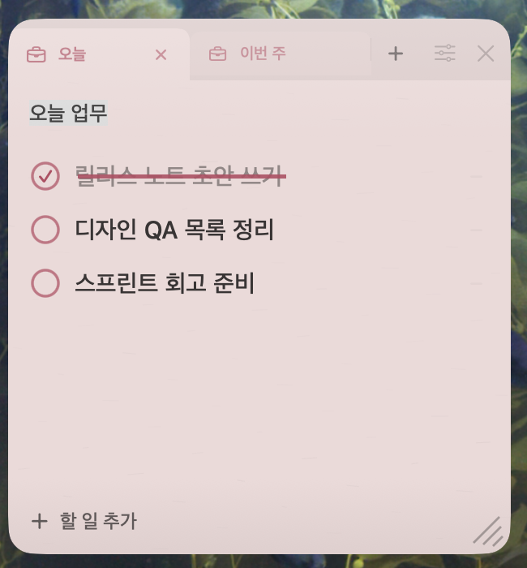
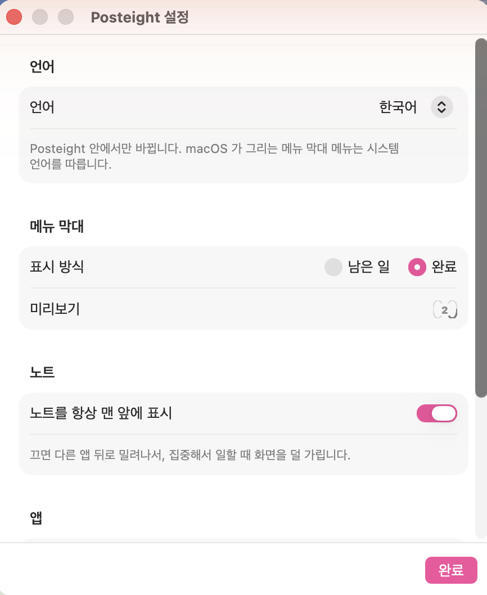

# Posteight

**맥을 위한 사적인 포스트잇 — 보이는 시점은 내가 정한다.**

Posteight 는 오늘 할 일을 바탕화면에 꺼내 둔다. 작업이 실제로 일어나는 자리마다
독립된 작은 창을 놓고, 누가 다가오면 감춘다.

[English](README.md) · 한국어



## 설치

### 요구 사항

| | |
| --- | --- |
| macOS | 14 (Sonoma) 이상 |
| Mac | Apple Silicon 전용 — `ARCHS` 가 `arm64` 로 고정되어 있어 Intel Mac 은 지원하지 않는다 |
| 인터페이스 언어 | 한국어 / 영어, 설정에서 전환 |

### 내려받기

[Releases](https://github.com/hmjlon/posteight/releases) 에서 최신 `.dmg` 를 내려받아 열고,
**Posteight** 를 **응용 프로그램** 으로 끌어다 놓는다.

### 처음 열 때

Posteight 는 아직 Apple 공증을 받지 않아서, macOS 가 첫 실행을 한 번 막는다.

1. Posteight 를 연다. 경고가 뜨고 실행이 거부된다.
2. **시스템 설정 → 개인정보 보호 및 보안** 을 연다.
3. 아래로 내려 **그래도 열기** 를 누른다.

설치당 한 번만 하면 된다. 터미널을 쓴다면 아래 한 줄로도 같다.

```bash
xattr -dr com.apple.quarantine /Applications/Posteight.app
```

공증에는 유료 Apple Developer Program 멤버십이 필요하다. 그전까지는 앱을 직접 빌드한
사람이 아닌 이상 이 단계를 피할 수 없다.

## 사용하기

### 메모 창



메모는 각자 떠 있는 창이고, 놓아둔 자리를 기억한다. 안쪽의 컴팩트한 탭 바는 메모 폭을
균등하게 나눠 쓰기 때문에 가로 스크롤이 없다. 창 하나에 목록 여러 개를 나란히 둘 수 있다.

- 독립적으로 떠 있고 크기를 조절할 수 있는 메모 창 여러 개
- 메모마다 붙는 탭. 활성 탭을 한 번 더 누르면 그 자리에서 이름을 고친다
- 완료할 때 펜으로 줄을 긋는 애니메이션 체크리스트
- 종이 색, 펜 색, 펜 종류, 분류 스티커
- 복원과 영구 삭제가 되는 휴지통
- 오늘 기록 미리보기와 Markdown 클립보드 내보내기

### 메뉴 막대


Posteight 에는 메인 창이 없다. 상태 아이템이 유일한 상설 표면이다. 오늘의 개수가 적힌
접힌 카드 하나가 할 일이 끝날 때마다 아래에서부터 차오른다. 누르면 팝오버가 열리고,
거기서 빠른 입력, 메모 창 열기, 오늘 기록, 휴지통, 설정, 종료로 간다.

설정은 일부러 작게 유지한다. 상태 아이템이 무엇을 세는지, 메모를 다른 앱 위에 띄울지,
Dock 아이콘을 남길지. Dock 아이콘은 기본으로 켜져 있어서 실행 중인 Posteight 를 Dock 과
Command-Tab 으로 부를 수 있고, 누르면 메모 창이 다시 나온다. 끄면 메뉴 막대에만 사는 앱이 된다.

### 언어



Posteight 는 한국어와 영어로 읽힌다. 고르기 전까지는 맥의 언어를 따른다.
**설정 → 언어** 를 바꾸면 앱이 직접 그리는 모든 문구가 재실행 없이 바뀐다. 팝오버, 메모의
조작 버튼, 휴지통, 오늘 기록까지 — 열려 있는 메모 창도 누르는 즉시 따라온다.
직접 적은 것은 적은 그대로 남는다. 메모 내용, 탭 이름, 제목은 번역하지 않는다.

macOS 가 직접 그리는 메뉴(파일, 편집, 윈도우)는 여전히 시스템 언어를 따른다.

### 메모가 저장되는 곳

메모는 `~/Library/Application Support/Posteight/` 에 로컬로 저장된다. 계정도, 동기화도,
사용 정보 수집도 없다. 내보내기는 명시적으로만 일어난다 — 오늘 기록을 Markdown 으로
클립보드에 복사하는 것이 전부다. Notion 동기화는 아직 구현되어 있지 않다.

이건 시각적 프라이버시이지 보안 금고가 아니다. 자리를 비우거나 화면을 공유할 때 우연한
노출을 줄여 주지만, 잠기지 않은 화면에 지금 보이는 내용을 옆사람이 읽는 것까지 막지는 못한다.

## 라이선스

독점 소프트웨어다. [LICENSE](LICENSE) 를 참고한다. 오픈소스가 아니다.

---

Posteight 를 직접 빌드하거나 동작을 고치려면 [AGENTS.md](AGENTS.md) 에 빌드 경로, 저장 규칙,
릴리스 절차, 커밋 규범이 있다. 제품과 디자인 방향은 [docs/PRODUCT.md](docs/PRODUCT.md) 가 원본이다.
