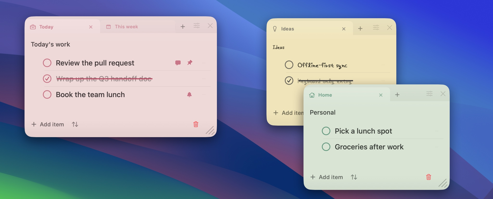
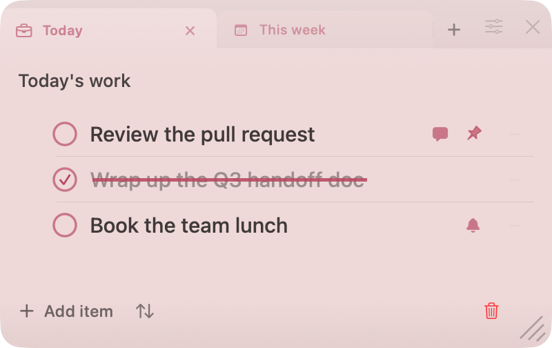
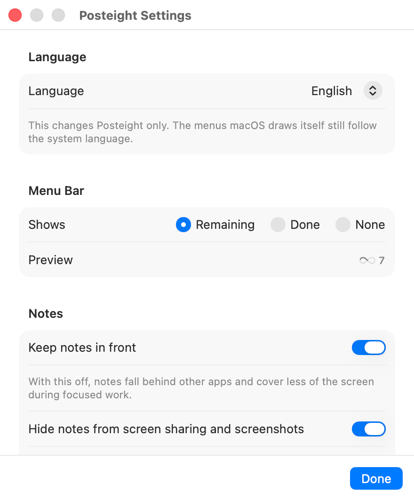

# Posteight

**Private sticky notes for your Mac — visible on your terms.**

[](https://github.com/hmjlon/posteight/releases/latest)

Posteight keeps today's checklist out on the desktop, in small independent windows you can
put where the work actually happens — and hide when someone walks over.

English · [한국어](README.ko.md)



## Install

### Requirements

| | |
| --- | --- |
| macOS | 14 (Sonoma) or later |
| Mac | Apple silicon only — `ARCHS` is pinned to `arm64`, so Intel Macs are not supported |
| Interface language | Korean or English, switchable in Settings |

### Homebrew

```bash
brew install --cask hmjlon/tap/posteight
```

`brew upgrade` picks up later versions from the same tap.

### Download

Or download the latest `.dmg` from [Releases](https://github.com/hmjlon/posteight/releases),
open it, and drag **Posteight** to **Applications**.

### First launch

Posteight is not notarized by Apple yet, so macOS blocks it the first time it runs —
whichever way you installed it.

1. Open Posteight. macOS shows a warning and refuses to launch it.
2. Open **System Settings → Privacy & Security**.
3. Scroll down and click **Open Anyway**.

The same thing from a terminal:

```bash
xattr -dr com.apple.quarantine /Applications/Posteight.app
```

It comes back on every update, including `brew upgrade`. Posteight is signed ad-hoc, so its
signature changes with each build and Homebrew cannot tell the new version is the same app
you already approved.

Notarization needs a paid Apple Developer Program membership. Until that is in place, this
step is unavoidable for anyone but the person who built the app.

## Using Posteight

### Memo windows



Each memo is its own floating window that remembers where you put it. Inside, a compact
tab bar splits the memo width evenly — no horizontal scrolling — so one window can hold
several lists side by side.

- Multiple independent, floating, resizable memo windows
- Per-memo tabs, renamed inline by clicking the active tab again
- Checklists with an animated pen strike-through on completion
- Paper colors, pen colors, pen styles, and per-tab icons, all set from the pen case
- Closing a memo window — the close button or Esc — only hides it; the memo stays
- Trash with restore and permanent-delete actions
- Daily work log preview and clipboard export as Markdown

### Menu bar


Posteight has no main window. The status item is the only permanent surface: the 8 of
Posteight drawn as a small infinity loop, with today's count beside it. The loop traces
itself as items get done and completes when nothing is left. Clicking it opens the popover —
quick capture, opening memo windows, hiding every memo at once, the daily log, the trash,
settings, and quit.

Settings stay small: what the status item counts, whether notes float above other apps,
whether memos stay out of screen shares and screenshots, and whether Posteight keeps a
Dock icon. The Dock icon is on by default, so a running Posteight can be reached from the
Dock and Command-Tab, and clicking it brings the memo windows back. Turning it off leaves
a menu-bar-only app.

### Language



Posteight reads in Korean or English, and follows your Mac's language until you pick one.
**Settings → Language** switches every string the app draws itself — the popover, the memo
controls, the trash, the daily log — with no relaunch; open memo windows change as you click.
What you typed stays exactly as you typed it: note text, tab names, and titles are yours, not
translated.

The menus macOS draws itself — File, Edit, Window — still follow the system language.

### Where your notes live

Notes are stored locally in `~/Library/Application Support/Posteight/`. There is no
account, no sync, and no telemetry. Export is explicit: the daily log copies to the
clipboard as Markdown. Notion synchronization is not implemented yet.

Locking the screen puts the visible memos away, and unlocking brings them back where they
were; memos you hid yourself stay hidden either way. Memo windows are also left out of
screen shares, recordings, and screenshots — handing your screen to a meeting does not
hand over the memos. Turn that off in **Settings → Notes** when the memos are what you
mean to show. Neither asks for an extra permission.

This is visual privacy, not a security-vault promise. Posteight can reduce accidental
exposure when you step away or share a screen, but it cannot prevent someone nearby from
reading content that is currently visible on an unlocked display.

## License

Proprietary. See [LICENSE](LICENSE). This is not open source.

---

Building Posteight, or changing how it behaves? [AGENTS.md](AGENTS.md) is the contributor guide:
the stack, the entry point and window routing, the code structure, build paths, persistence rules,
the release flow, and commit conventions.
